# Design Document

**Author**: Team 59

Version 3.0

**Version**:

| Version        | Time           | Description  |
| ------------- |:-------------:| -----------------------:|
| 1.0      | 06/28/2019 | Initial version of DesignDocument.md |
| 2.0      | 07/04/2019 | Add part of the GUI design|
| 3.0      | 07/12/2019 | Update GUI design, class diagram, component diagram and class description|

## 1 Design Considerations

- There should be no lag between action and response of the application.
- The GUI design, code development and testing was performed on the Pixel 2 and Nexus 5 device emulators running Android version 8.0. The application is confirmed to run on both devices. It has not been confirmed to run on devices with resolutions and screen sizes lower than that of the Nexus 5.
- The User Interface is designed be easy to use and intuitive and responsive.

### 1.1 Assumptions

- The application will run on Android 8.0 devices with resolutions similar to those of Pixel 2 and Nexus 5.
- Users  have the basic knowledge of navigating Android applications and can interact with the devices.
- The application will run independently and not communicate with other applications on the device.
- The application will not be able to create an Administrator account. The Administrator account should already exist in the database and accessible through the system.

### 1.2 Constraints

- No testing was performed on devices with resolutions lower than the aforementioned devices and is not guaranteed to render properly on devices with lower resolutions.
- The application stores session and game data locally on the device.

### 1.3 System Environment

#### Hardware
- Pixel 2 with Android 8.0 and Nexus 4 with Android 8.0.
- Device has sufficient ram to run the application. 

#### Software
- Android 8.0 or higher
- SDK 23

## 2 Architectural Design

### 2.1 Component Diagram

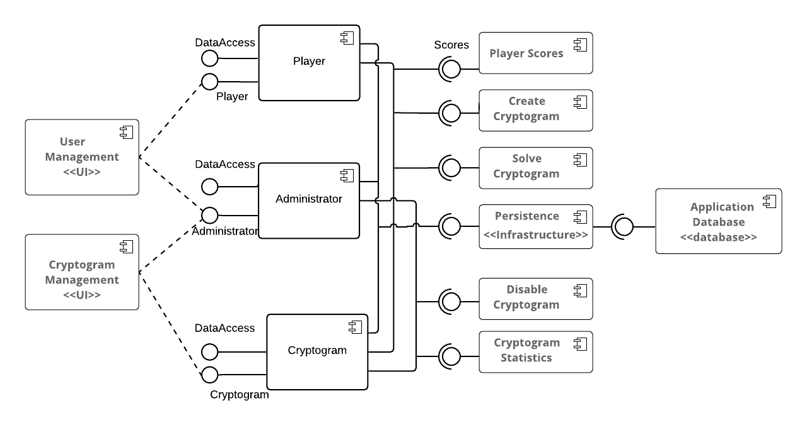

The application consist of three tiers. The first tier is the front-end views which contains all the layouts for the UI. The second tier is the middle-end components which provides the logic and event processing. The data access components are also in this tier. Moreover, the persistence functionality and the outputs from the activities such as newly created cryptograms, player scores, cryptogram statistics are computed and pushed to the database from the middle-tier. The third tier is the back-end tier which consist of components to create the tables, query the tables, and update the tables in the embedded SQLite database.

### 2.2 Deployment Diagram

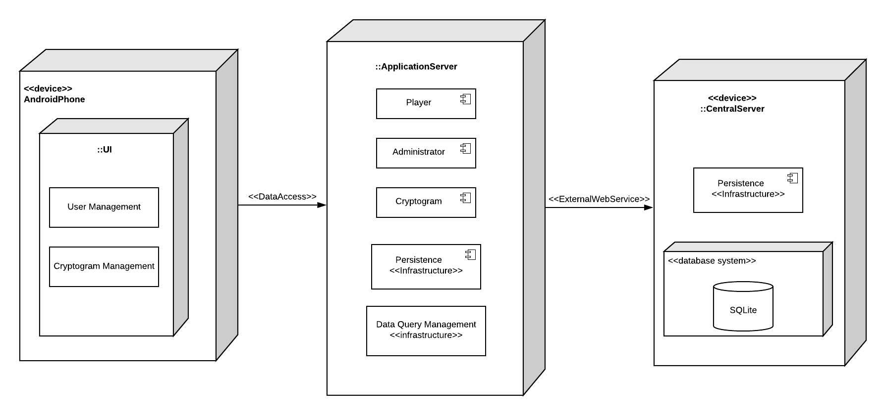

The application is packaged in an APK file and can be deployed on either the Pixel 2 or Nexus 5 emulator. The Android GUI will render the GUI from the layout files, and the Java modules will run on the Android application server. The tables will be created on the embedded SQLite database on the first startup of the application. In game sessions are also persisted in the form of serialized json files so players can log off or close the application and come back to the same game at a later time.

## 3 Low-Level Design

#### List of Classes

- **AddNewCryptogram** - This class allows the player to create a new cryptogram. The letter mapping is performed by two drop down lists/spinners. The drop down lists of letters are dynamic and will update as the player replaces each unique letter from the unencoded phrase. This class will also check that the title is unique and the hint field is populated. This class also ensures that Non-alphabetic characters are ignored and case is preserved.
- **AdminMainMenu** - This class serves as the gateway to administrative functions.
- **CryptogramStats** - This class retrieves all of the cryptogram statistics from the database for the administrator.
- **CryptoStatsDetailActivity** - This class retrieves the details of a cryptogram from the database for the administrator.
- **CryptoStatsOptionsAcitivty** - This class serves as the gateway for the administrator to view cryptogram details and to disable a cryptogram and penalize its creator. 
- **Database** - This class provides common data access functions for the other classes to retrieve information about players, cryptogram, etc from the SQLite database.
- **DatabaseHelper** - This class creates all the tables in the SQLite database and populates it with sample cryptogram information, statistics, players, administrator, scores, etc.
- **DisableCryptogramActivity** - This class implements the functions to disable a cryptogram and to penalize the creator.
- **LoginActivity** - This class implements the login screen and validation for both the player and the administrator. Additionally, this class will implement the sign up screen for new players and will validate that the new player's username is unique.
- **PlayerMainMenu** - This class implements the main menu for the player.
- **PlayerViewScores** - This class retrieves the player scores and renders a table of all user scores and games played for the player.
- **SolveCryptogram** - This class contains the logic for the play/solve cryptogram activity and interacts with the play cryptogram UI screen. It contains data field listeners that will validate that the points bet are between 1 and 10, and that the letters are uniquely mapped and that a valid random cryptogram is retrieved from the database. In general, this class will enforce all the constraints and limitations for solving a cryptogram that are found in the Assignment 5 requirements. This class also keeps track of attempts and will persist the game session when the user goes back to the main menu or logs off or closes the application. This class will update the player's points and cryptogram statistics.

#### Database Tables

- **user_table:** This table contains information about the users of the application. It has the data of admin and the players. The user_table consists of the following columns:

    1. **user_id:** This is a autogenerated unique ID for every user.
    2. **user_name:** This column contains the username of the user.
    3. **user_password:** This column contains the password of the user.
    4. **user_email:** This column contains the email address of the user.
    5. **user_is_admin:** This column contains 1 if user is admin and 0 if the user is a player.

- **cryptogram_table:** This table contains information about the cryptograms in the application. The cryptogram_table consists of the following columns:

    1. **cryptogram_id:** This is a autogenerated unique ID for every cryptogram in the application.
    2. **cryptogram_title:** This column contains the unique and case-sensitive title of the cryptogram.
    3. **cryptogram_solution:** This column contains the solution of the cryptogram.
    4. **cryptogram_created_by:** This column contains the ID of the player who created the cryptogram. It references to the player_id in the player_table.
    5. **cryptogram_hint:** This column contains the hint of the cryptogram.
    6. **cryptogram_created_on:** This column contains the date on which the cryptogram was created in dd-mm-yyyy format.
    7. **cryptogram_is_enabled:** This column contains 1 if the cryptogram is enabled and 0 if the cryptogram is disabled.
    8. **cryptogram_encoded_phase:** This column contains the encoded phase of the cryptogram.

- **player_table:** This table contains the points of each player. The player_table consists of the following columns:

    1. **player_id:** This column contains the player ID of the player. It references to the player_id in the player_table.
    2. **player_points:** This column contains the player points.

- **player_cryptos_table:** This table contains information about the cryptograms played by the user. The player_cryptos_table consists of the following columns:

    1. **player_id:** This column contains the player ID of the player. It references to the player_id in the player_table.
    2. **cryptogram_id:** This column contains the cryptogram ID. It references to the cryptogram_id in the cryptogram_table.
    3. **attempt_id:** This is a autogenerated unique ID for each entry in this table.
    4. **is_crypto_solved:** This contains 1 if the cryptogram was solved successfully and 0 if the cryptogram was not solved in that attempt.

### 3.1 Class Diagram
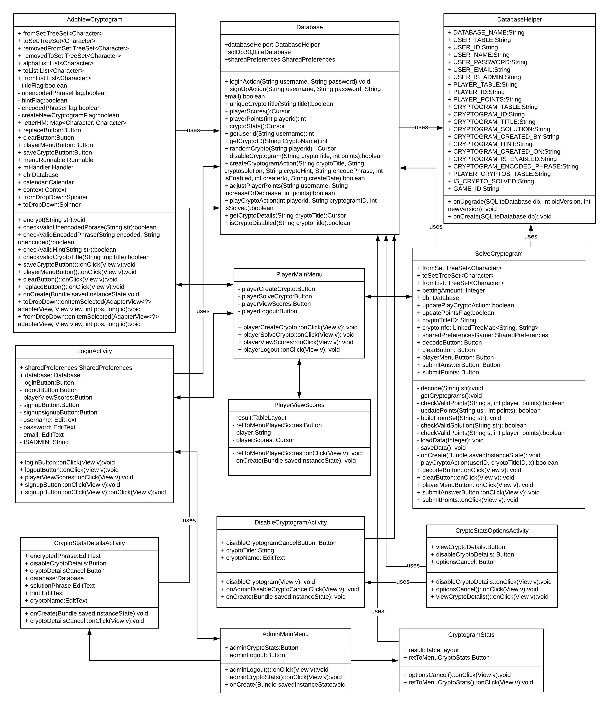

## 4 User Interface Design
The following screen layouts were designed for players to create new cryptograms, solve existing cryptograms and place bets, view player scores and for administrators to disable cryptograms & penalize cryptogram creators, and view cryptogram statistics. Finally there is a screen for new players to sign up.
#### Login Screen
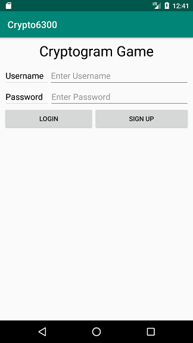
#### Player Signup Screen
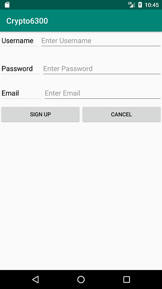
#### Player Main Menu Screen
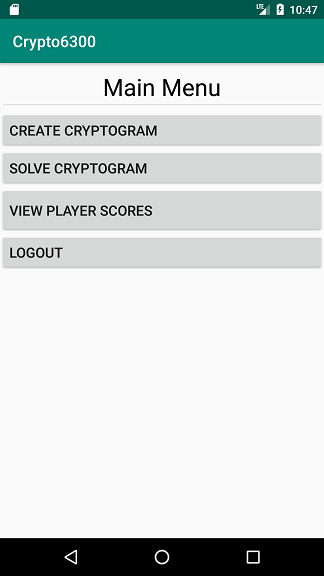
#### Create a new cryptogram screen
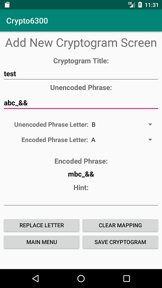
#### Solve cryptogram screen
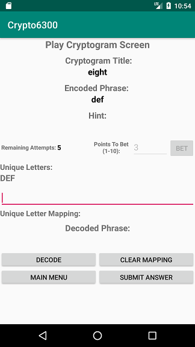
#### View player score screen
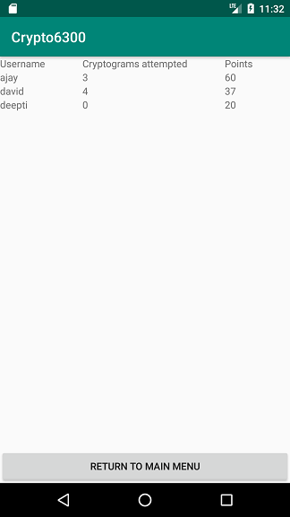
#### Administrator Main Menu screen
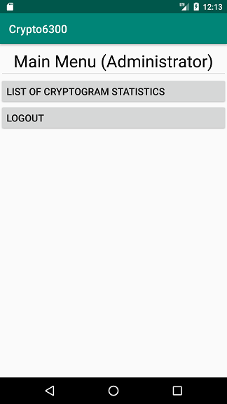
#### View cryptogram statistics screen
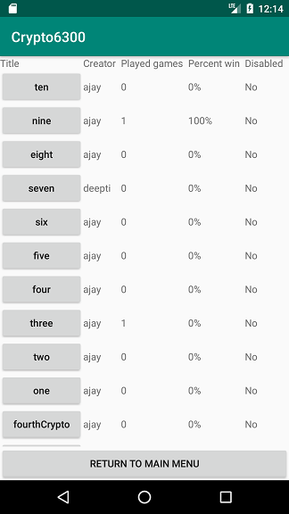
#### View cryptogram details screen
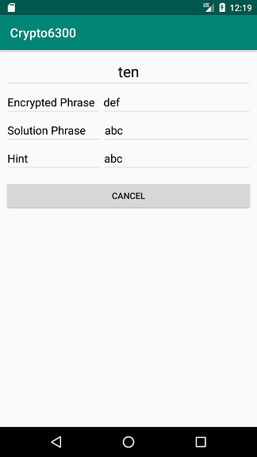
#### View cryptogram statistics screen
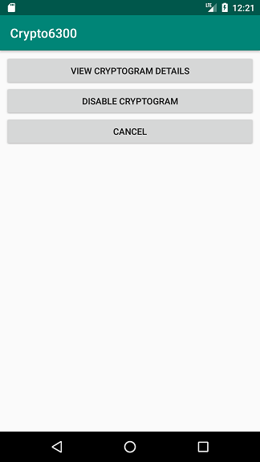
#### Disable cryptogram and penalize the creator screen
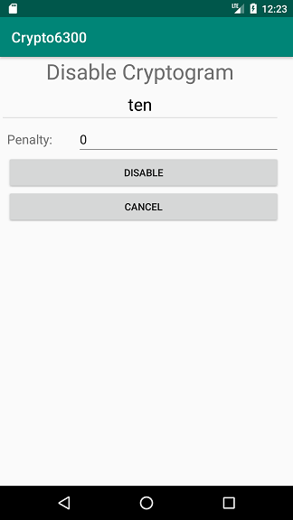

