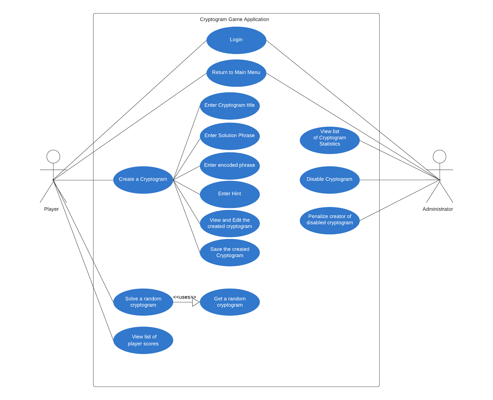

# Use Case Model

**Author**: Team 59

Version: 1.1

| Version        | Time           | Description  |
| ------------- |:-------------:| -----------------------:|
| 1.0      | 06/28/2019 | Initial version of UseCaseModel.md document |
| 1.1      | 07/12/2019 | Updating document format |

## 1 Use Case Diagram

## 2 Use Case Descriptions

### 1. User Login
- **Requirements:** The User can take the role of Player or Administrator and log in to the Cryptogram Game Application.
- **Pre-conditions:** The User who is trying to login should be an existing user of the Application.
- **Post-conditions:** The User will be able to log in to the application after he provides valid username and password.
- **Scenarios:**
    1. The User launches the application.
    2. The User enters the username and password.
    3. The User clicks on Log In button.

### 2. Create a cryptogram
- **Requirements:** The Player chooses to create a cryptogram by choosing Create Cryptogram option from the menu.
- **Pre-conditions:** The Player must be a valid registered user of the Application.
- **Post-conditions:** The cryptogram should be created based on the details entered by the Player. The cryptogram statistics will be updated.
- **Scenarios:**
     1. The Player selects "Create Cryptogram" option from the menu.
     2. The Player enters the cryptogram title, solution phrase, encoded phrase and hint.
     3. The Player views the information he has entered and edits the information as needed.
     4. The Player clicks on the Save button to save the cryptogram he created.

### 3. Solve a Random Cryptogram
- **Requirements:** The player must be able to get a random cryptogram and solve the cryptogram.
- **Pre-conditions:** The Player must be a valid registered user of the Application and the Player must be provided with a cryptogram that was not created by him and which was not previously attempted by him.
- **Post-conditions:** The player solves and submits the solution to the cryptogram and the player score and cryptogram statistics will be updated accordingly.
- **Scenarios:**
	 1. The Player selects "Solve Cryptogram" option from the menu.
     2. The Player can bet points on solving next cryptogram.
     3. The Player will match possible replacement and encrypted letters together, and view the resulting potential solution.
     4. The Player submits the solution if it is correct.

### 4. View List of player scores
 - **Requirements:** The Player should be able to view all the player scores.
 - **Pre-conditions:** The Player must be a valid registered user of the Application.
 - **Post-conditions:** The Player will be provided with list of player scores.
 - **Scenarios:**
    1. The Player selects "View Player Scores" option from the menu.
    2. The Player will be presented with list of players and their corresponding score details.

### 5. View list of cryptogram statistics
 - **Requirements:** The Administrator must be able to view the statistics of all the Cryptogram present in the application.
 - **Pre-conditions:** The user must be registered as an Administrator.
 - **Post-conditions:** The Administrator will be able to list of cryptograms and clicking on each Cryptogram will display its statistics.
 - **Scenarios:**
    1. The Administrator selects "View list of cryptogram statistics" option from the menu.
    2. The Administrator clicks on a Cryptogram from the displayed list of cryptograms.
    3. The Administrator will be able to view details of selected Cryptogram.

### 6. Disable a cryptogram
- **Requirements:** The Administrator must be able to disable a Cryptogram.
- **Pre-conditions:** The User must be registered as an Administrator.
- **Post-conditions:** The Cryptogram will be disabled.
- **Scenarios:**
   1. The Administrator selects "View list of cryptogram statistics" option from the menu.
   2. The Administrator clicks on a Cryptogram from the displayed list of cryptograms.
   3. The Administrator clicks on the Disable button.

### 7. Penalize a Player
 - **Requirements:** The Administrator must be able to penalize the Player whose cryptogram was disabled.
 - **Pre-conditions:** The User must be registered as an Administrator.
 - **Post-conditions:** The Player will be penalized.
 - **Scenarios:**
    1. The Administrator selects "View list of Cryptogram statistics" option from the menu.
    2. The Administrator clicks on a Cryptogram from the displayed list of cryptograms.
    3. The Administrator clicks on the Disable button.
    4. The Administrator finds the creator of the disabled cryptogram.
    5. The Administrator penalizes the creator of the disabled cryptogram.

### 8. Return to main menu
 - **Requirements:** The User must be able to return to the main menu
 - **Pre-conditions:** The User must be registered and logged into the application.
 - **Post-conditions:** The User will return to the main menu.
 - **Scenarios:**
    1. The User selects "Return to Main Menu" option from the menu.
    2. If the User is a Player, he will be returned to the Player menu.
    3. If the User is a Administrator, he will be returned to the Administrator menu.
    4. The Administrator penalizes the creator of the disabled cryptogram.

   
