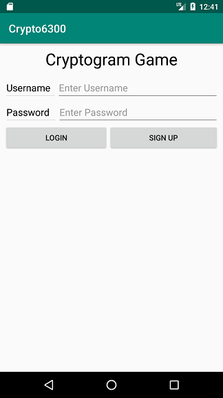
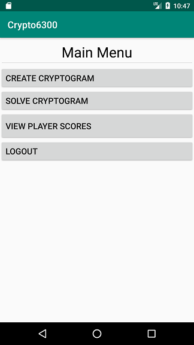
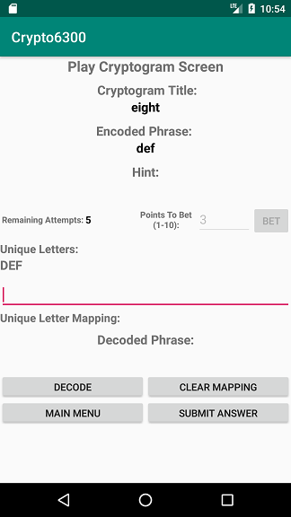
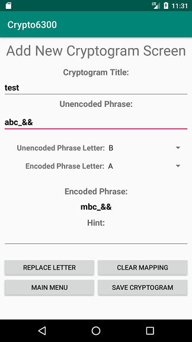
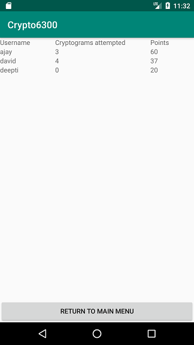
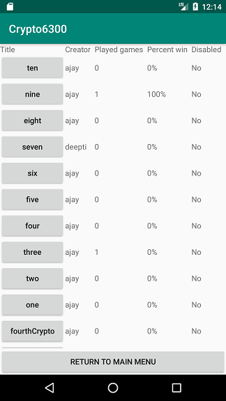
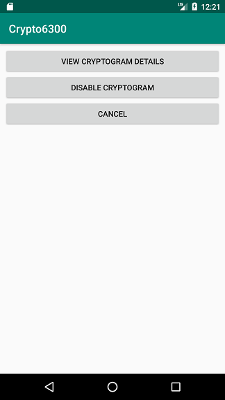
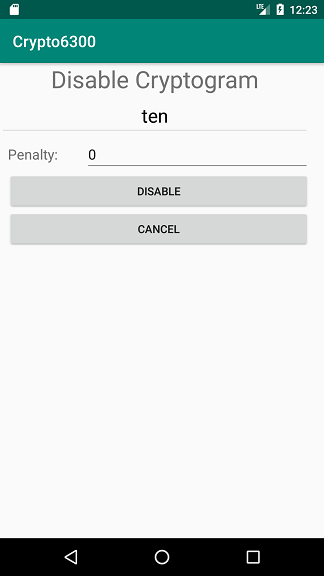

# User Manual

**Author**: Team 59

Version: 2.0

| Version        | Time           | Description  |
| ------------- |:-------------:| -----------------------:|
| 1.0      | 07/03/2019 | Initial version of UserManual.md |
| 2.0      | 07/11/2019 | Update the UserManual.md after bug fixes and code enhancements|

  
## Introduction

This app lets users create and play cryptograms (https://cryptograms.puzzlebaron.com/faq.php).

## System Requirement

**For desktop or laptop**: A desktop or laptop that has Android Studio, Android SDK 23, and Android ROM 8.0 or higher is required to compile and test the project.

**For Android device**: Android 8.0 or higher on a Pixel 2 or Nexus 5 or Android devices with similar screen resolutions is required to run the app and play the game.

## Installation

**For desktop or laptop**
1. Open the "Crypto6300" project in Android Studio. 
2. Click "Run app".
3. Select an existing Android Virtual Device or create a new AVD and open the app in the device.

**For Android device**:
1. Copy the app.apk file to your android device. 
2. Open the file and follow the instructions to install.

## Usage

### As a Player

#### Sign-up & Login
1. Start the app.
2. If you are using the app for the first time, in the login menu, click "SIGN UP" button to create a new user.
3. In the sign up menu, enter a unique username, password, and email and click on "Submit". You will be automatically logged in to the application after a successful sign up.
4. If you already have a username and password, you can directly log in to the application by providing them in the Login screen.

#### Solve a cryptogram
1. After login, in the player's main menu, click the "SOLVE CRYPTOGRAM" button.
2. Enter the points to bet and click on "BET". The points will be added to your total player score if you submit the correct solution within 3 attempts. Points will be deducted from your score if you submit wrong solutions in all 5 attempts. The points to bet should be between 1 to 10 (inclusive) and not higher than your current total score. You'll get an error message if you enter invalid number of points to bet.
3. Once you enter the points and click on the BET button, you'll be shown a random cryptogram. The encoded phrase is shown under "Encoded Phrase". The unique letters in the encoded phrase has been extracted and presented under "Unique Letters:" in upper cases. Enter the mapped letters in the decoded phrase corresponding to the position of each unique letter in the encoded phrase. The mapped letters are case insensitive.
4. Click the "DECODE" button to see the decoded phrase with your mappings. Click "CLEAR MAPPING" if you want to redo the above step 3.
5. Click the "SUBMIT ANSWER" button to submit your mapping. You'll get a message indicating if the mapping is correct or not. You will have 5 attempts for each cryptogram. You can always go back to the main menu or log out in the middle of the game. If you do, the next time you click "SOLVE CRYPTOGRAM" in the main menu, you will go back to the game before you left with the remaining number of attempts.
 

#### Create a cryptogram
1. After login, at the player's main menu, click "CREATE CRYPTOGRAM" button.
2. Enter a title to the cryptogram under "Cryptogram title". The title needs to be unique. You'll see an error message if the title is not unique.
3. Enter the unencoded phrase of the cryptogram under "Unencoded Phase". It can have non-alphabetic characters. But they will be preserved in the encoded phase together along with the case of the letters. Each unique letter in you unencoded phase will be available in the drop-down list next to "Unencoded Phase Letter" in upper case.
4. Select one letter in the "Unencoded Phase Letter", and then select one letter in the "Encoded Phase Letter" to replace it, and click on the "REPLACE LETTER" button.
5. Repeat step 4 until you replaced all the letters in the unencoded phrase. You can click on "CLEAR MAPPING" if you want to redo all of the replacement.
6. Enter a hint to help players solve the puzzle under "Hint:".
7. After entering all the above details, click the "SAVE CRYPTOGRAM" button. After the successful creation of the cryptogram, it will be available for players to play and you will be rewarded with 5 points.

#### View player scores
1. After login, at the player's main menu, click the "VIEW PLAYER SCORES" button.
2. This will show the username, cryptogram attempted, and scores of all of the existing players.

### As the Administrator 

#### Login
The system has one administrator account. After logging in as the administrator, you will have the rights to view cryptogram statistics, cryptogram details, and disable a cryptogram so players can no longer solve it, and penalize the creator of the disabled cryptogram.

To login as the administrator, enter below account info in the login menu:
  * Username: admin
  * Password: admin

#### View cryptogram statistics and details
1. After logging in as the administrator, you will enter the administrator main menu. Click the "LIST OF CRYPTOGRAM STATISTICS" button to view the statistics.
2. All cryptograms from newest to oldest, and cryptogram statistics including creator, number of games played using the cryptogram, percent of games win, and whether the cryptogram has been disabled will be displayed.
2. To view details(i.e, encoded phase, unencoded phase, hint) of a cryptogram, click on the cryptogram title.

#### Disable a cryptogram and penalize its creator
1. After logging in as the administrator, click the "LIST OF CRYPTOGRAM STATISTICS" button.
2. Click on the title of the cryptogram which you want to disable and then click on the "DISABLE CRYPTOGRAM" button.
3. Enter the number of points between 1 to 10 (inclusive) in the "Penalty" field and click the "DISABLE" button. The cryptogram's creator will lose the points entered in the penalty field.

#### Extra Notes
To prevent the "cold start" problem (for example, no cryptogram has been created by players, and no cryptogram can be solved by new player), we have added some initial cryptograms and players into the system. You can find their details in the view player scores and view cryptogram statistics screens.

